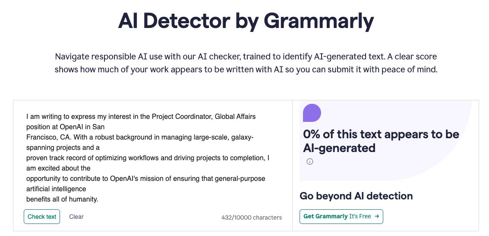

# ResumeAI

ResumeAI is a job application tool for lazy people. Generate custom resumes/CVs for the jobs you like autmagically using AI while you sleep.

ResumeAI will take your current resume and use it to create a tailored resume and cover letter for a job you want to apply for using Large Language Models (LLMs). And it will do that for 000s of jobs of your preference while you sleep. 

It works as a wrapper for [rendercv](https://github.com/rendercv/rendercv), enhancing its capabilities with AI-powered resume creation.

You can see right away that a **tailored resume** give you better chance to get the job:


Skip the jobs that are **not a good match for you:**


## Key Features

- **Job Matching to Your Preferences**: Use AI to check how well the job description matches your personality and your job requirements.
- **AI-Powered Resume Generation**: Automatically creates tailored resumes for specific job descriptions using LLMs of your choice (Bedrock and OpenAI are supported)
- **Old vs New Resume Comparison**: Compares both your current and newly generated resume against job requirements with detailed scoring
- **Multiple way to add Job Description**: Process job descriptions from:
    - Text files (.txt)
    - Online job postings (via URLs)
- **Cover Letter Generation**: Optional automated creation of personalized cover letters
- **AI Detection Avoidance**: Integration with WordAI for content rewriting (optional) to avoid AI detection tools
- **Visual Match Scoring**: Clear visual representation of how well your resumes match job requirements

# Quickstart
1. run `poetry install` to set up dependencies
2. put your old CVs into **resume_ai/app/user_data/resumes** directory
3. update config.json with:
 - your name
 - the path to your old CV
 - operating mode (files or links)
 - your theme. Default is `engineeringresumes` Check out themes here: https://github.com/rendercv/rendercv/tree/main/examples
 - your job preferences in file `resume_ai/app/user_data/user_data.py`

Watch the video bellow for a quick guide:

[](https://www.loom.com/share/0ad82822f89b45f9b5fa449fcea24618?sid=7588bde7-9772-4779-89ed-c7903273ceb9)

2. Configure your setup in `config.json`:
```json
{
  "name": "Your Name",
  "current_resume_name": "your-current-resume.pdf",
  "mode": "files",
  "theme": "chosen-theme",
  "target_highlights_length_words": 50,
  "wordai_api_key": "",
  "multiple_pages": false,
  "write_cover_letter": false,
  "match_job_to_user_pref": true
}
```

### Configuration Options

- **mode**: Choose between:
    - `files`: Process job descriptions from text files
    - `links`: Process job descriptions from URLs
- **theme**: Select from available [rendercv themes](https://github.com/rendercv/rendercv/tree/main/examples)
- **target_highlights_length_words**: Set target word count for experience highlights
- **wordai_api_key**: Optional API key for WordAI integration to avoid AI detection
- **multiple_pages**: Allow resume to span multiple pages if needed
- **write_cover_letter**: Enable automatic cover letter generation
- **match_job_to_user_pref**: If you had filled in your job preferences in `user_data.py`, AI will tell you how well the job matches to your requirements.
- **match_job_to_user_pref_limit**: Skip the jobs that do not meet your standards. Put a decimal as a percentage (0.8 = 80%)

## Usage

1. Place your current resume(s) in `user_data/resumes_old/`
2. Choose your operating mode:
    - For `files` mode: Add job descriptions as .txt files in `user_data/job_descriptions/`
    - For `links` mode: Add job posting URLs to `job_descriptions/job_links.json`
3. Run the application

### Directories

- `user_data/resumes_old/`: Store your current resume(s) in PDF format
- `user_data/job_descriptions/`: Place job descriptions as individual .txt files (filename will be used for the new resume)
- `user_data/job_descriptions_processed/`: Automatic storage for processed job descriptions
- `YOUR_NAME_CV.yaml`: Template file that can be customized for the AI generation process

## Advanced Features

- **Resume Matching Analysis**: Visual comparison of how well both old and new resumes match job requirements
- **Custom Instructions**: Ability to specify length and format preferences
- **Automatic File Management**: Processed job descriptions are automatically organized
- **PDF Generation**: Automatic conversion of YAML to professionally formatted PDF resumes

### Skipping jobs that are not a good match
If you do not want to apply for jobs that are an obvious bad match (example, you want part-time and the job offers full-time only), you can enable that in config parameters. So, resumes will be created only for the jobs, whose description matches at least X% of your requirements.
1. Write your requirements in `resume_ai/app/user_data/user_data_TEMPLATE.py`
2. rename it to `resume_ai/app/user_data/user_data.py`
3. Set `match_job_to_user_pref` in config to 'true'
4. Set % match threshold for `match_job_to_user_pref_limit` in config to a float (ex: 0.85 = 85%)

### Avoiding AI Detectors
You can use additional plugins to ensure your newly created resume does not get flagged by AI detectors, often employed by recruiters to screen resumes.


## Notes

- You can move processed job descriptions back to `user_data/job_descriptions` to reprocess them
- The YAML template (`YOUR_NAME_CV.yaml`) can be manually edited for customization
- Job description filenames are used to name the generated resumes